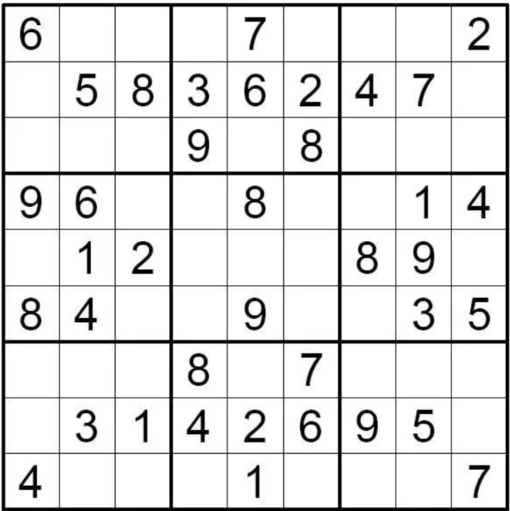
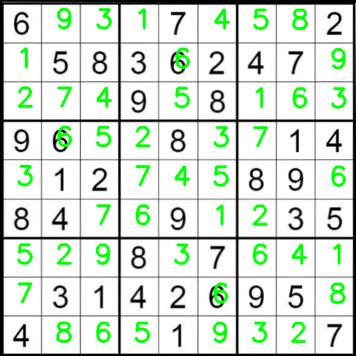

# Sudoku Solver with Computer Vision

Проект для распознавания и решения головоломок судоку с использованием компьютерного зрения и нейронных сетей.

## Особенности проекта

- 📸 Автоматическое распознавание судоку с фотографий
- 🔍 Распознавание цифр с помощью CNN (сверточной нейронной сети)
- 🧩 Алгоритм решения судоку с backtracking
- 🖼️ Визуализация решения прямо на исходном изображении
- 📈 Точность распознавания цифр: >98%

## Технологический стек

- Python 3.8+
- OpenCV (обработка изображений)
- TensorFlow/Keras (нейронная сеть для распознавания цифр)
- scikit-image (обработка изображений)
- Tesseract OCR (не используется в финальной версии, но присутствует как опция)

## Структура проекта

sudoku/
├── model/                   # Обученные модели
│   └── model.py             # Основная модель для распознавания цифр
├── samples/                 # Примеры изображений судоку
│   ├── sudoku.png           # Пример 1 - исходное изображение        
│   └── solved_sudoku.png    # Результат обработки
├── src/                     # Исходный код
│   ├── image_processing.py  # Обработка изображений
├── requirements.txt         # Зависимости Python
├── README.md                # Документация
└── .gitignore               # Игнорируемые файлы

## Пример работы

<p align="center">
  
  
  <br>
</p>

## Установка и запуск

1. Клонируйте репозиторий:
```bash
git clone https://github.com/ваш-username/ваш-репозиторий.git
cd ваш-репозиторий
